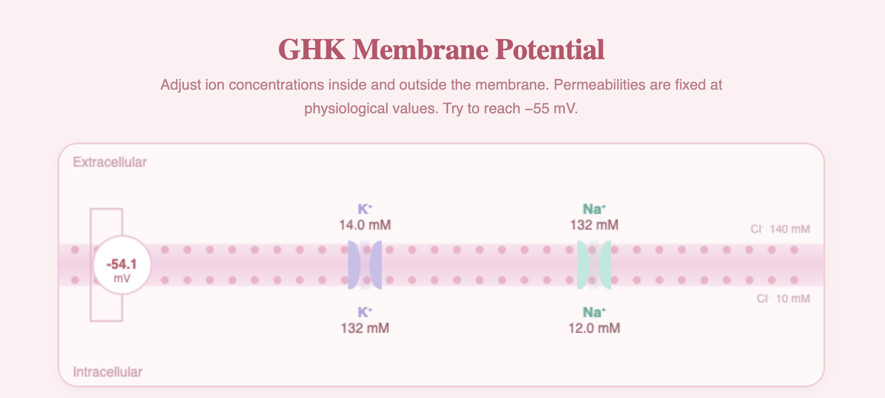

# GHK Membrane Potential

An interactive simulation of the Goldman–Hodgkin–Katz equation built with Vite and the Canvas API. Explore how changing ion concentrations inside and outside a neuron's membrane shifts the resting membrane potential — and discover what it takes to push a cell toward firing threshold.



## What is the GHK Equation?

The Goldman–Hodgkin–Katz equation, developed independently by David Goldman (1943) and Alan Hodgkin and Bernard Katz (1949), predicts the steady-state membrane potential of a cell when multiple ion species are permeant. It generalises the simpler Nernst equation to account for the fact that real membranes are permeable to several ions simultaneously, each contributing in proportion to its permeability:

**Vm = (RT/F) · ln[ (P_K·[K]o + P_Na·[Na]o + P_Cl·[Cl]i) / (P_K·[K]i + P_Na·[Na]i + P_Cl·[Cl]o) ]**

Where Vm is the membrane potential, R is the gas constant, T is temperature in Kelvin, F is Faraday's constant, and P_K, P_Na, P_Cl are the relative permeabilities of potassium, sodium, and chloride. Subscripts o and i denote outside and inside concentrations.

Permeabilities are fixed at physiological resting values — high K⁺ permeability, low Na⁺ permeability, moderate Cl⁻ — matching the state of a real neuron at rest:

| Ion | Permeability |
|-----|-------------|
| K⁺  | 1.00        |
| Na⁺ | 0.04        |
| Cl⁻ | 0.45        |

Default concentrations are set to standard resting neuron values:

| Ion | Outside | Inside |
|-----|---------|--------|
| K⁺  | 5 mM    | 140 mM |
| Na⁺ | 145 mM  | 12 mM  |
| Cl⁻ | 140 mM  | 10 mM (locked) |

RT/F is evaluated at body temperature (37°C), giving 25.7 mV.

## Features

- Live cell membrane diagram rendered on HTML5 Canvas with a voltmeter that updates in real time
- Four adjustable sliders — K⁺ and Na⁺ concentrations both inside and outside the membrane
- Metric cards displaying Vm, E_K (Nernst potential for K⁺), and E_Na (Nernst potential for Na⁺)
- Challenge — try to reach −55 mV (depolarisation threshold) by adjusting concentrations
- Cl⁻ concentrations locked at physiological values throughout
- Reset button returns all values to resting neuron defaults (~−67 mV)

## Install

```bash
git clone https://github.com/ruedaniels/ghk-membrane-vite.git
cd ghk-membrane-vite
npm install
npm run dev
```

Then open http://localhost:5173 in your browser.

## How to Use

- **K⁺ outside** — raising extracellular potassium depolarises the membrane
- **K⁺ inside** — lowering intracellular potassium has the same depolarising effect
- **Na⁺ outside** — raising extracellular sodium nudges Vm slightly toward E_Na
- **Na⁺ inside** — has minimal effect at rest due to low Na⁺ permeability
- **Challenge** — try to reach exactly −55 mV. Hint: K⁺ outside is the most powerful lever

## How It Works

On each slider change, three values recompute in real time:

- Vm via the full GHK equation
- E_K via the Nernst equation: (RT/F) · ln([K]o / [K]i)
- E_Na via the Nernst equation: (RT/F) · ln([Na]o / [Na]i)

The membrane diagram redraws on the Canvas API at every update — ion concentrations float above and below the bilayer, the voltmeter reflects Vm live, and K⁺ channels (lavender) and Na⁺ channels (mint) are rendered as protein shapes spanning the membrane.

## Simplifications

- Permeabilities are fixed — the simulation does not model voltage-dependent channel gating
- Cl⁻ is included in the GHK calculation but its concentrations cannot be adjusted
- Temperature is fixed at 37°C
- The model assumes steady-state — membrane potential updates instantaneously with concentration changes

## Known Limitations

- Does not model the Na⁺/K⁺-ATPase pump that maintains concentration gradients in living cells
- No time dynamics — ion flux is not integrated over time
- Concentration ranges are constrained to physiologically plausible values

## Tech Stack

- Vite
- Vanilla JavaScript
- HTML5 Canvas API
- DM Sans + DM Serif Display (Google Fonts)

## References

- Goldman, D.E. (1943). Potential, impedance, and rectification in membranes. *Journal of General Physiology*, 27(1), 37–60.
- Hodgkin, A.L., & Katz, B. (1949). The effect of sodium ions on the electrical activity of the giant axon of the squid. *Journal of Physiology*, 108(1), 37–77.
- Nernst, W. (1888). Zur Kinetik der in Lösung befindlichen Körper. *Zeitschrift für Physikalische Chemie*, 2, 613–637.
- Hille, B. (2001). *Ion Channels of Excitable Membranes* (3rd ed.). Sinauer Associates.
- Harvard University & MIT. *Fundamentals of Neuroscience, Part 1: The Electrical Properties of the Neuron*. HarvardX, edX. https://www.edx.org/learn/neuroscience/harvard-university-fundamentals-of-neuroscience-part-1-the-electrical-properties-of-the-neuron